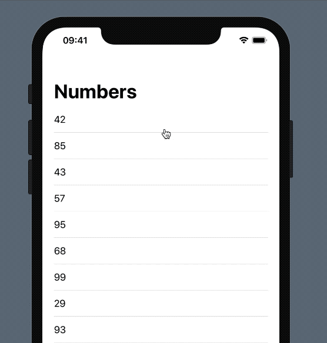

# SwiftUI-PullToRefresh

Pull to refresh implementation in SwiftUI for **List and NavigationView**

This article helped me a lot: https://swiftui-lab.com/scrollview-pull-to-refresh/
Thanks!



## Installation: 

It requires iOS 13 and Xcode 11!

In Xcode got to `File -> Swift Packages -> Add Package Dependency` and paste inthe repo's url: `https://github.com/AppPear/SwiftUI-PullToRefresh`  

## Usage: 
You need to add `RefreshableNavigationView(title: String, action: () -> Void, content: () -> View)` to your View. Title is the navigationView title, and the action takes the refresh function. RefreshableNavigationView already encapsulates a List() so in the content you only need to define your cells. If you want TableViewCellSeparators don't forget to add a `Divider()` at the bottom of your cell.

Example: 

```swift
import SwiftUIPullToRefresh

struct ContentView: View {
    @State var numbers:[Int] = [23,45,76,54,76,3465,24,423]
    
    var body: some View {
        RefreshableNavigationView(title: "Numbers", action:{
            self.numbers = self.generateRandomNumbers()
        }){
            ForEach(self.numbers, id: \.self){ number in
                VStack(alignment: .leading){
                    Text("\(number)")
                    Divider()
                }
            }
        }
    }
    
    func generateRandomNumbers() -> [Int] {
        var sequence = [Int]()
        for _ in 0...30 {
            sequence.append(Int.random(in: 0 ..< 100))
        }
        return sequence
    }
}
```


